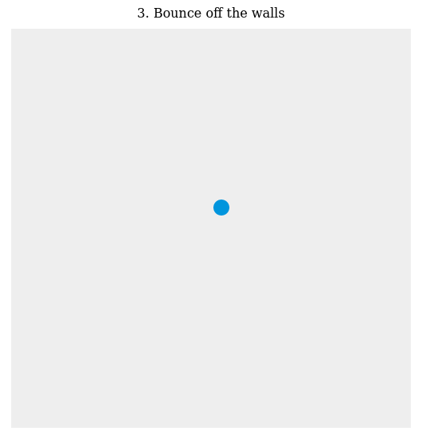
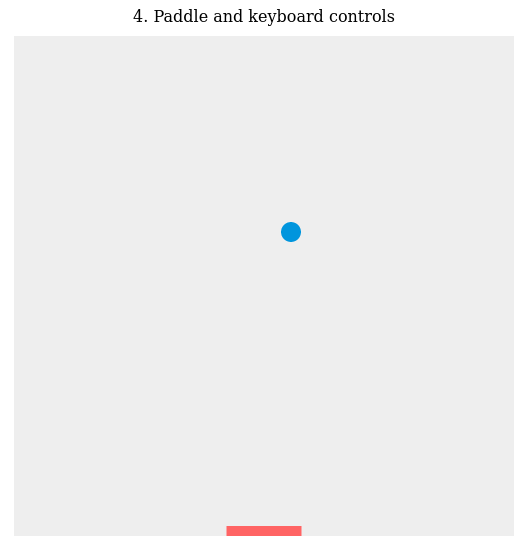
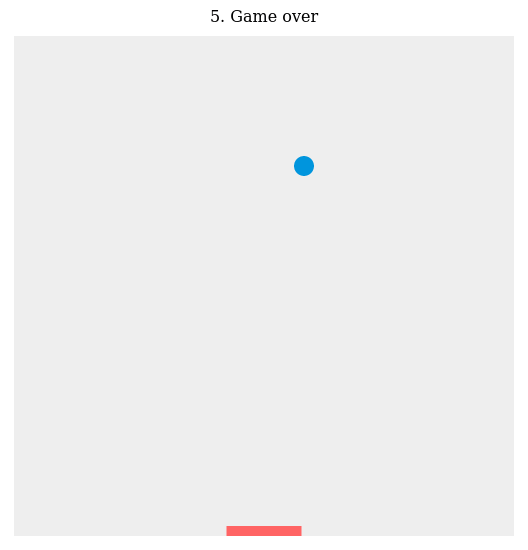
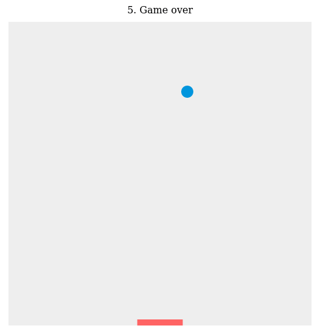
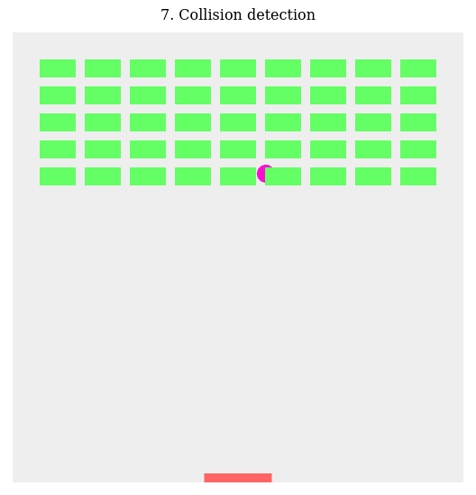
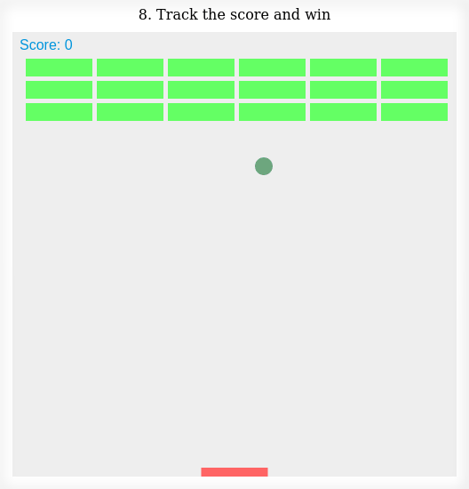
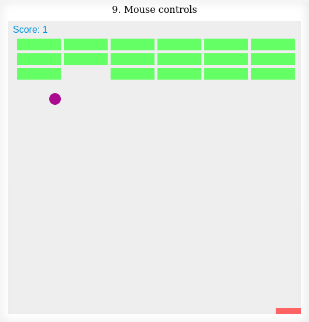
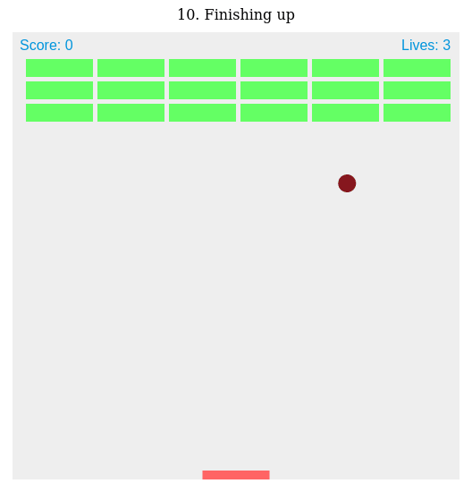

# 2D-breakout-game

2D breakout game using pure JavaScript - MDN Game Development Tutorials

This is a step-by-step tutorial offered by [MDN Web Docs](https://developer.mozilla.org/en-US/).

## What does the purpose?

It's just a repository for practicing and studying Vanilla JavaScript. In this tutorial we create a simple MDN Breakout game written entirely in pure JavaScript and rendered on HTML5 [`<canvas>`](https://developer.mozilla.org/en-US/docs/Web/HTML/Element/canvas).

Every step has editable, live samples available to play with so I can see what the intermediate stages should look like.

The level of this tutorial requires intermediate [JavaScript](https://developer.mozilla.org/en-US/docs/Learn/Getting_started_with_the_web/JavaScript_basics) knowledge. After working through this tutorial I should be able to build my own simple Web games.

<figure>

<figcaption>Source: <a href="https://developer.mozilla.org/en-US/docs/Games/Tutorials/2D_Breakout_game_pure_JavaScript">MDN Web Docs - 2D breakout game</a></figcaption>
</figure>

## Lesson details

The tutorial is divided in 10 sections:

1. Create the Canvas and draw on it
1. Move the ball
1. Bounce off the walls
1. Paddle and keyboard controls
1. Game over
1. Build the brick field
1. Collision detection
1. Track the score and win
1. Mouse controls
1. Finishing up

I will practice the basics of using the [`<canvas>`](https://developer.mozilla.org/en-US/docs/Web/HTML/Element/canvas) element to implement fundamental game mechanics like:

1. rendering and moving images;
1. collision detection;
1. control mechanisms;
1. and winning and losing states.

## Schedule

Each topic will be studied in 2 days, one day for reading and developing and another for practicing the concepts. Thus, the whole tutorial will be completed in 20 days or less.

#### So, let's start

 1. <strike>Create the Canvas and draw on it</strike> 

 
 

 2. <strike>Move the ball</strike> 

 
 

 3. <strike>Bounce off the walls</strike> 

 
 

 4. <strike>Paddle and keyboard controls</strike> 

 
 

 5. <strike>Game over</strike> 

 5 (Bonus). <strike>Increasing the difficulty and creating a SCORE</strike> 

 
 

 6. <strike>Build the brick field</strike> 

 
 

 7. <strike>Collision detection</strike> 

 
 

 8. <strike>Track the score and win</strike> 

 
 

 9. <strike>Mouse controls</strike> 

 
 

 10. <strike>Finishing up</strike>

 
 

## Finished!

I've been learning many canvas features this last days, and I learned how to draw and make movements using canvas. Now it's time to improve the game and code a new one from scratch.

This game can be improved adding movement angle depending on the paddle side the ball hits it, if the ball hits centre to left side the ball movement is to the left, if the ball hits centre to right the ball moves to the right.

Another thing is creating a start button, that makes the start game only when we click the button.

Changing the number of bricks or giving "lives" to the bricks is another game improvement.

Today the game has normal to hard difficulty, but it's possible creating a difficulty button in the very game beginning as well.

### Canvas learning

Canvas is not something hard to learning, but depending on what we want to do it's not so simple. Because of this project I decided draw the logo of an online school that taught me the basics of JavaScript, CSS, and HTML, the Ingate Educa logo. It was too hard, specially because I needed drawing each Bézier curve one by one. It's not impossible, but... it's not the best thing to do, I did it only for learning, because we have many tools and things better than canvas today.
