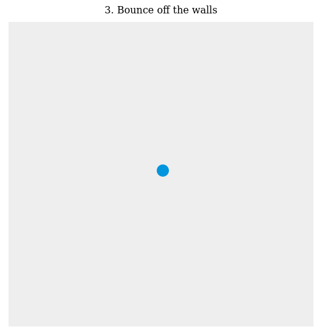

# 2D-breakout-game

2D breakout game using pure JavaScript - MDN Game Development Tutorials

This is a step-by-step tutorial offered by [MDN Web Docs](https://developer.mozilla.org/en-US/).

## What does the purpose?

It's just a repository for practicing and studying Vanilla JavaScript. In this tutorial we create a simple MDN Breakout game written entirely in pure JavaScript and rendered on HTML5 [`<canvas>`](https://developer.mozilla.org/en-US/docs/Web/HTML/Element/canvas).

Every step has editable, live samples available to play with so I can see what the intermediate stages should look like.

The level of this tutorial requires intermediate [JavaScript](https://developer.mozilla.org/en-US/docs/Learn/Getting_started_with_the_web/JavaScript_basics) knowledge. After working through this tutorial I should be able to build my own simple Web games.

<figure>

<figcaption>Source: <a href="https://developer.mozilla.org/en-US/docs/Games/Tutorials/2D_Breakout_game_pure_JavaScript">MDN Web Docs - 2D breakout game</a></figcaption>
</figure>

## Lesson details

The tutorial is divided in 10 sections:

1. Create the Canvas and draw on it
1. Move the ball
1. Bounce off the walls
1. Paddle and keyboard controls
1. Game over
1. Build the brick field
1. Collision detection
1. Track the score and win
1. Mouse controls
1. Finishing up

I will practice the basics of using the [`<canvas>`](https://developer.mozilla.org/en-US/docs/Web/HTML/Element/canvas) element to implement fundamental game mechanics like:

1. rendering and moving images;
1. collision detection;
1. control mechanisms;
1. and winning and losing states.

## Schedule

Each topic will be studied in 2 days, one day for reading and developing and another for practicing the concepts. Thus, the whole tutorial will be completed in 20 days or less.

 1. <strike>Create the Canvas and draw on it</strike> 

 
 

 2. <strike>Move the ball</strike> 

 
 

 3. <strike>Bounce off the walls</strike> 

 
 

 4. <strike>Paddle and keyboard controls</strike> 

 
 

 5. <strike>Game over</strike> 

 5 (Bonus). <strike>Increasing the difficulty and creating a SCORE</strike> 

 
 

6. <strike>Build the brick field</strike>

 
 

7. <strike>Collision detection</strike>

 
 

8. Track the score and win
9. Mouse controls
10. Finishing up

<!-- 
8. <strike>Track the score and win</strike>

 
  -->

<!-- 
9. <strike>Mouse controls</strike>

 
  -->

<!-- 
10. <strike>Finishing up</strike>

 
  -->

## So, let's start
